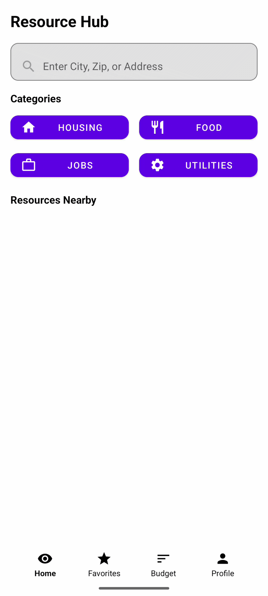
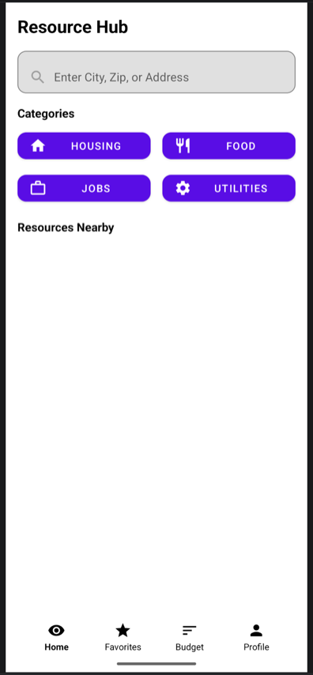
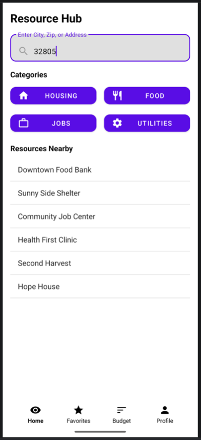
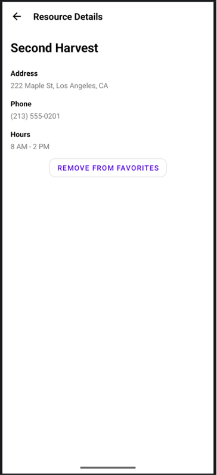
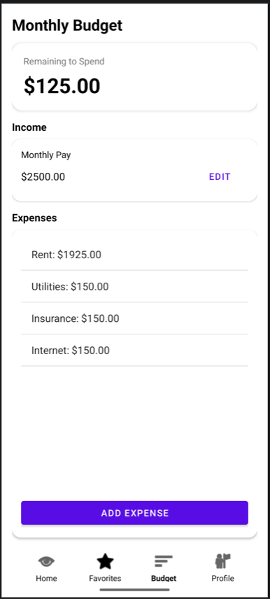

# 📱 Resource Hub

> Helping users quickly find essential community resources in their area.

Resource Hub is an Android mobile application designed to help users locate nearby resources such as housing, food banks, job centers, and utilities. The app also includes budgeting tools to help users manage their finances alongside accessing support services.

---

## 🎥 Demo



---
## 🚀 Features

- 🔍 **Location-Based Search**
  - Enter a city, ZIP code, or address to find nearby resources

- 📂 **Category Filtering**
  - Browse resources by category:
    - Housing
    - Food
    - Jobs
    - Utilities

- ⭐ **Favorites System**
  - Save frequently used resources for quick access

- 💰 **Budget Tracking**
  - Track income and expenses
  - View remaining balance

- 📄 **Resource Details**
  - View address, phone number, and hours for each resource

- 👤 **User Profile**
  - Manage account information and preferences

---

## 🎯 Purpose

The goal of Resource Hub is to provide a **simple and accessible tool** for individuals who need quick access to essential services. It is especially designed to support people experiencing financial challenges by combining **resource discovery with budgeting tools** in one application.

---

## 🎯 Target Audience

- Individuals seeking local assistance (food, housing, jobs)
- Users managing tight budgets
- Community members needing quick access to services

---

## 🛠️ Technologies Used

- **Language:** Kotlin / Java  
- **IDE:** Android Studio  
- **UI Design:** XML layouts  
- **Data Storage:** SharedPreferences  
- **Version Control:** Git & GitHub  

---

## 📸 Screenshots

### Home Screen


### Search Results


### Resource Details


### Budget Screen


---

## ⚙️ Installation & Setup

1. Clone the repository

```bash
git clone https://github.com/Sfayson1/ResourceHub.git
```
2. Open the project in Android Studio

3. Sync Gradle

4. Run the app on:
  - Android Emulator
  - OR Physical Device

📦 Project Structure
```
ResourceHub/
│
├── app/
│   ├── activities/
│   ├── models/
│   ├── adapters/
│   ├── layouts/
│   └── utils/
│
├── resources/
└── README.md
```
---
🧪 Testing

- The app was tested using:

- Android Emulator

- Multiple screen sizes

- Navigation between activities

- Input validation for search and budget features

---
⚠️ Challenges

- Managing navigation between multiple screens

- Handling user input and displaying dynamic data

- Designing a clean and user-friendly interface

- Debugging layout issues across devices

----
🔄 Future Improvements

- Integrate real APIs for live resource data

- Add user authentication

- Implement Google Maps integration

- Improve UI/UX design and animations

- Add notifications and reminders

---
💡 Lessons Learned

- Importance of planning and breaking work into phases

- Using version control to track progress

- Debugging step-by-step instead of guessing

- Designing with the user experience in mind

---
🌟 Why This Project Matters

- This project demonstrates:

- Mobile app development fundamentals

- UI/UX design principles

- Problem-solving and debugging skills

- Real-world application development

---
📄 License

This project is for educational purposes.

---

👩🏽‍💻 Author

**Sherika Fayson**

Software Development Student

Future Software Engineer

---

🏷️ Badges


